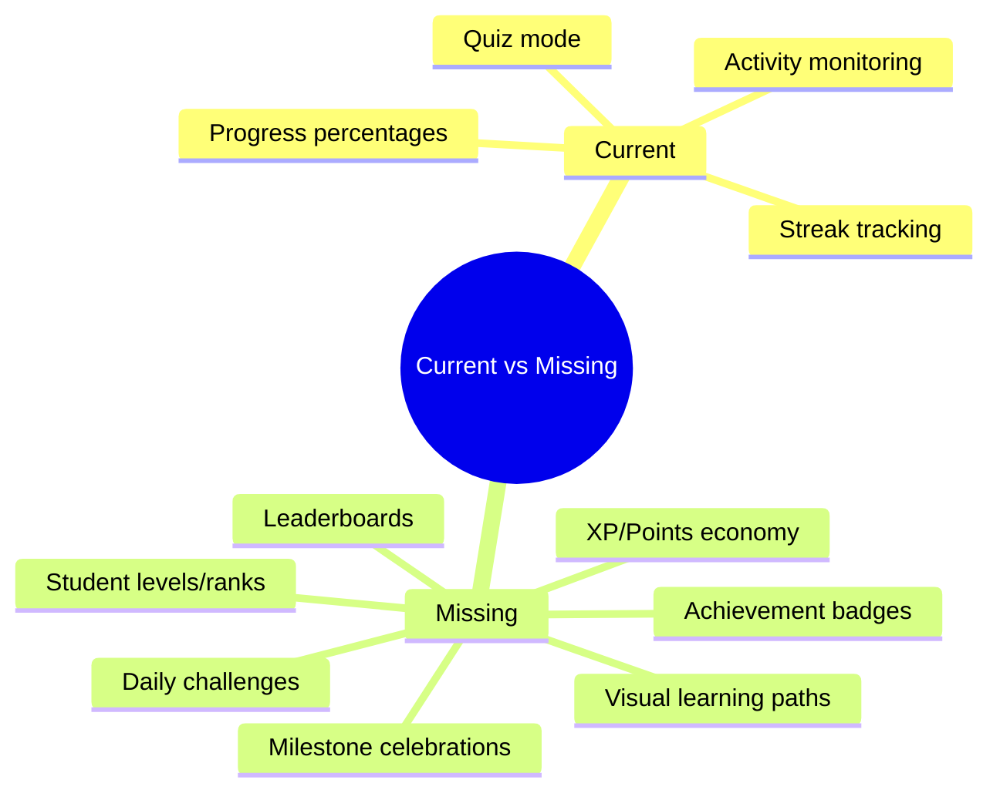
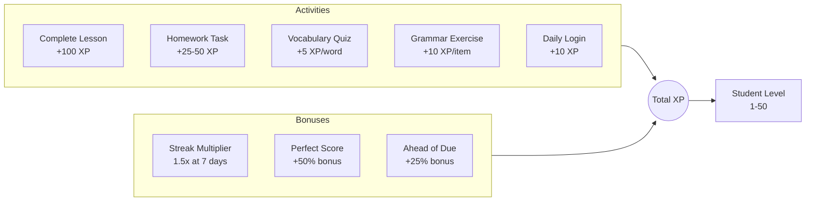
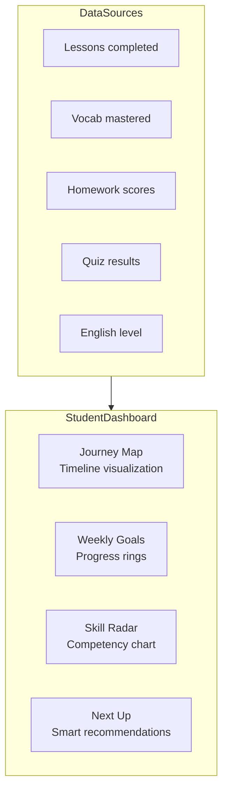
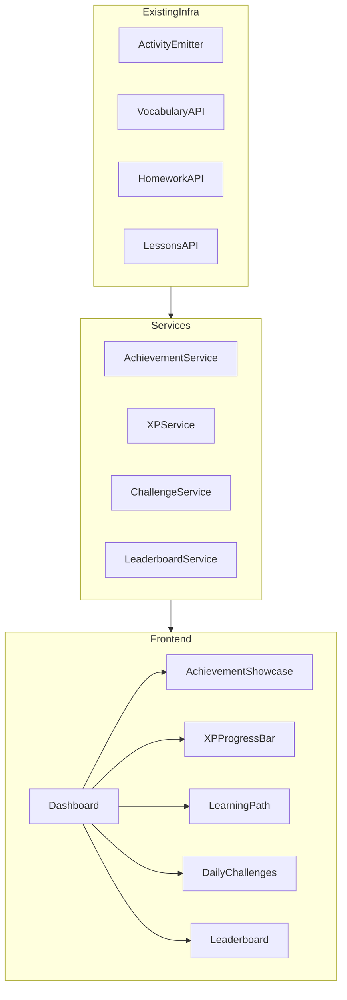
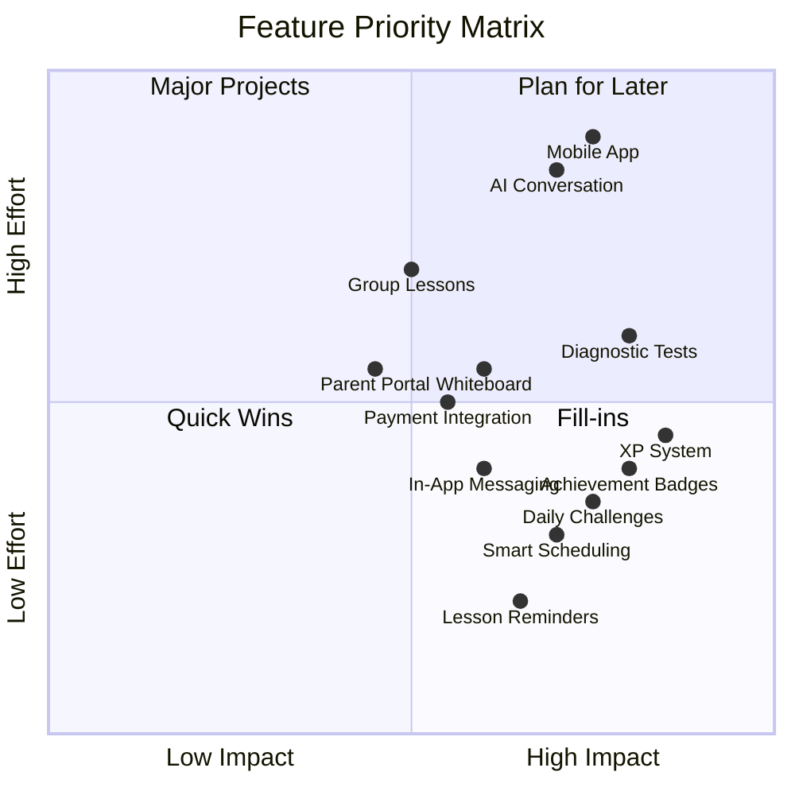

# Speakshire.com Platform Analysis & Gamification Proposal

## Current Platform Capabilities Summary

Your platform is already feature-rich with solid foundations for English teaching:

### Core Teaching Features

| Feature | Description ||---------|-------------|| **Lesson Management** | Scheduling, statuses (SCHEDULED, IN_PROGRESS, COMPLETED, etc.), lesson plans, objectives, notes, attachments || **Real-time Video Calls** | Daily.co integration with live transcription (AssemblyAI), session recording, synced content presentation || **Vocabulary System** | Dictionary with audio, translations, definitions, example sentences, difficulty ratings, quiz mode with streak tracking || **Homework System** | Multi-task assignments (VIDEO, READING, GRAMMAR, VOCAB, LINK, LISTENING) with progress tracking || **Lesson Content Editor** | Block-based rich editor with sections/rows/columns, draft/publish workflow || **Learning Materials** | Organized folders, listening tasks with AI audio generation, grammar exercises |

### Teacher Dashboard

| Feature | Description ||---------|-------------|| **Activity Monitoring** | Daily rollups (active/homework/vocab minutes), 7-day trends, online status || **Risk Assessment** | Low/medium/high risk levels, streak tracking, nudge functionality || **Real-time Sync** | Focus words highlighting, notes synchronization during lessons |

### Existing Gamification Elements

- **Vocabulary Quiz Mode** with translation/definition/listening modes and mastery streaks
- **Activity Tracking** via `activityEmitter.ts` (heartbeats, lesson joins, homework sessions)
- **Streak Days** tracking in student activity dashboard
- **Progress Percentages** on homework tasks

---

## Gap Analysis: What's Missing for True Gamification

---

## 5 Recommended Gamification Features

### Feature 1: Achievement Badge System

**Motivation**: Achievements provide clear goals and recognition, creating dopamine hits that reinforce positive behaviors.**Proposed Badges**:| Category | Examples ||----------|----------|| **Vocabulary** | "Word Collector" (learn 50 words), "Polyglot" (master 100 words), "Perfect Pronunciation" || **Homework** | "Early Bird" (submit 3 days early), "Streak Master" (7 consecutive on-time), "Perfectionist" (100% score) || **Lessons** | "Perfect Attendance" (10 lessons no-miss), "Active Learner" (speak 50% of lesson time) || **Grammar** | "Grammar Guru" (complete 20 exercises), "Flawless" (0 errors in exercise) || **Milestones** | "First Steps" (complete first lesson), "Level Up" (advance English level) |**Implementation Points**:

- New `achievements` table tracking badge definitions and unlock criteria
- New `student_achievements` junction table for earned badges with timestamps
- Badge display on student profile and dashboard
- Toast notifications when badges are earned
- Weekly/monthly badge summaries for teachers

**Key Files to Modify**:

- Create [`src/features/achievements/`](src/features/achievements/) - new feature module
- Extend [`src/types/index.ts`](src/types/index.ts) - new types
- Update [`src/pages/Dashboard.tsx`](src/pages/Dashboard.tsx) - badge showcase
- Create achievement service and hooks

---

### Feature 2: XP (Experience Points) and Level Progression

**Motivation**: A unified progression system that ties all activities together, giving students a tangible sense of advancement.**XP Economy Design**:

**Level Thresholds** (example):

- Level 1-10: 0-500 XP per level (beginner learners)
- Level 11-25: 500-1000 XP per level (intermediate)
- Level 26-50: 1000-2000 XP per level (advanced)

**Visual Elements**:

- XP progress bar on dashboard
- Level badge next to student name
- "XP gained today" indicator
- Level-up celebration animations

**Implementation Points**:

- New `student_xp` tracking table
- XP calculation service triggered by existing activity events
- Level definitions with thresholds
- Real-time XP updates via WebSocket

---

### Feature 3: Personal Learning Path Visualization

**Motivation**: Students need to see their journey - where they started, where they are, and where they're going.**Learning Path Components**:

1. **Journey Map** - Visual timeline showing:

- Completed lessons as nodes
- Vocabulary milestones (50, 100, 200 words)
- Level progression (A1 → A2 → B1, etc.)
- Achievements earned along the way

2. **Weekly Goals Dashboard**:

- Configurable targets (e.g., "3 lessons, 20 vocab words, 2 homework assignments")
- Progress rings for each goal
- "Suggested Next" recommendations based on gaps

3. **Skill Radar Chart**:

- Speaking, Listening, Reading, Writing, Grammar, Vocabulary
- Based on completed activities and quiz performance
- Teacher can see and adjust focus areas

**Implementation**:

**Key Files**:

- Create [`src/features/learningPath/`](src/features/learningPath/) - new feature
- Create [`src/components/dashboard/JourneyMap.tsx`](src/components/dashboard/JourneyMap.tsx)
- Create [`src/components/dashboard/WeeklyGoals.tsx`](src/components/dashboard/WeeklyGoals.tsx)
- Integrate with existing [`src/hooks/useTutorStatistics.ts`](src/hooks/useTutorStatistics.ts)

---

### Feature 4: Streak System Enhancement with Daily Challenges

**Motivation**: Current streak tracking is passive. Active daily challenges create habitual engagement.**Enhanced Streak Features**:

1. **Daily Challenge System**:

- Each day presents 3-5 mini-challenges
- Examples: "Learn 5 new words", "Complete 1 grammar exercise", "Review 10 flashcards"
- Completing all = daily streak maintained + bonus XP

2. **Streak Preservation**:

- "Freeze" tokens earned through achievements (preserve streak when life gets busy)
- Weekend mode (reduced requirements)
- Teacher-granted "excused absence"

3. **Streak Milestones**:

- 7 days: Bronze flame badge
- 30 days: Silver flame + 2x XP day
- 100 days: Gold flame + special title
- 365 days: Diamond flame (legendary status)

**Visual Elements**:

- Flame icon with current streak count
- Calendar heatmap showing activity history
- Streak recovery countdown when broken

**Implementation Leverage**:

- Extends existing streak tracking in [`src/features/activitySummary/types.ts`](src/features/activitySummary/types.ts)
- Uses existing `activityEmitter` events
- New `daily_challenges` and `challenge_completions` tables

---

### Feature 5: Social Leaderboards and Friendly Competition

**Motivation**: Social comparison motivates continued effort; students want to see how they compare to peers.**Leaderboard Types**:

1. **Weekly XP Leaderboard** (resets every Monday):

- Top 10 students across all of a teacher's students
- Or global (opt-in) leaderboard
- Rewards: Top 3 get bonus XP, special badge

2. **Vocabulary Champions**:

- Most words mastered this week
- Best quiz accuracy
- Most practice sessions

3. **Teacher Class Insights**:

- "Class Pulse" bar showing overall class engagement
- Anonymized distribution of activity levels
- "Students who improved most this week"

**Privacy Considerations**:

- Student opt-in/opt-out for public leaderboards
- Anonymous mode option (show rank but not name)
- Teacher-only aggregate views

**Implementation**:

- Leverage existing [`src/features/activitySummary/components/ClassPulseBar.tsx`](src/features/activitySummary/components/ClassPulseBar.tsx)
- New leaderboard service aggregating XP and achievements
- WebSocket updates for real-time ranking changes

---

## Architecture Overview

---

## Implementation Priority

| Priority | Feature | Complexity | Impact | Dependencies ||----------|---------|------------|--------|--------------|| 1 | **XP System** | Medium | High | Foundation for others || 2 | **Achievement Badges** | Medium | High | XP System || 3 | **Daily Challenges** | Medium | High | Streak logic exists || 4 | **Learning Path** | High | Medium | XP, Achievements || 5 | **Leaderboards** | Low | Medium | XP System |**Recommended Approach**: Start with XP System as the foundation, then layer achievements on top. Daily challenges can run in parallel. Learning path visualization and leaderboards come last as they depend on accumulated data.---

## Summary of Gamification Features

Your platform already has excellent teaching infrastructure. The 5 proposed gamification features would transform it from a teaching tool into an engaging learning experience:

1. **Achievement Badges** - Clear goals and recognition
2. **XP/Levels** - Unified progression system
3. **Learning Paths** - Visual journey and recommendations
4. **Daily Challenges** - Habitual engagement loops
5. **Leaderboards** - Social motivation and friendly competition

---

# Additional Features for a Complete Professional Tutoring Platform

Since Speakshire is a **tutoring platform** (not self-learning), the following features focus on enhancing the teacher-student relationship, professional delivery, and pedagogical effectiveness.---

## Category A: Assessment & Progress Tracking

### Feature 6: Diagnostic Placement Tests

**Purpose**: Accurately assess student's initial level and identify specific weak areas.**Components**:

- Quick assessment (15-20 min) covering grammar, vocabulary, listening, reading
- Adaptive difficulty based on answers
- Detailed skill breakdown report
- Automatic CEFR level assignment (A1-C2)
- Recommended learning focus areas

**Teacher Benefits**:

- Objective baseline for new students
- Identify gaps to address in lessons
- Track improvement over time with periodic re-testing

---

### Feature 7: Periodic Progress Assessments

**Purpose**: Regular checkpoints to measure improvement and adjust teaching strategy.**Components**:

- Monthly/quarterly mini-assessments
- Compare against initial placement
- Visual progress graphs (before/after)
- Skill-by-skill improvement tracking
- PDF progress reports for parents/students

**Implementation**:

- Reuse grammar/vocab quiz infrastructure
- Add reading comprehension and listening sections
- Generate comparative analytics

---

### Feature 8: Speaking Assessment with AI Feedback

**Purpose**: Objective evaluation of spoken English between lessons.**Components**:

- Record-and-submit speaking exercises
- AI-powered analysis: pronunciation, fluency, grammar
- Phoneme-level feedback (which sounds need work)
- Comparison to native speaker patterns
- Teacher can review and add comments

**Technology**:

- Speech-to-text with confidence scores
- Pronunciation scoring APIs (Azure Speech, Google)
- Waveform visualization

---

### Feature 9: Writing Portfolio & Feedback System

**Purpose**: Track writing improvement with structured teacher feedback.**Components**:

- Student submits writing assignments
- Teacher provides inline corrections (grammar, vocabulary, style)
- Error categorization (spelling, tense, word choice, etc.)
- Writing complexity metrics (sentence length, vocabulary diversity)
- Portfolio timeline showing improvement
- Templates for common writing tasks (emails, essays, stories)

---

## Category B: Enhanced Lesson Experience

### Feature 10: Interactive Whiteboard

**Purpose**: Real-time collaborative drawing and annotation during lessons.**Components**:

- Shared canvas between teacher and student
- Drawing tools (pen, shapes, text, highlighter)
- Import images/PDFs to annotate
- Save whiteboard sessions to lesson history
- Templates (grammar tables, timelines, mind maps)

**Use Cases**:

- Explain grammar visually
- Diagram sentence structure
- Collaborative brainstorming
- Spelling/pronunciation exercises

---

### Feature 11: Document Annotation Tools

**Purpose**: Mark up shared materials during video lessons.**Components**:

- PDF/image annotation overlay
- Highlight, underline, circle, add notes
- Both teacher and student can annotate
- Save annotations to lesson record
- Export annotated documents

---

### Feature 12: Lesson Recording Library

**Purpose**: Students can review past lessons; teachers can demonstrate teaching quality.**Components**:

- Automatic lesson recording (opt-in)
- Searchable library by date, topic, student
- Timestamp bookmarks for key moments
- Transcription integration (already have AssemblyAI)
- Privacy controls and retention policies

---

### Feature 13: In-Lesson Mini-Games & Activities

**Purpose**: Break up lesson monotony with engaging interactive exercises.**Game Types**:

- Word matching (drag & drop)
- Spelling bee (audio prompt → type word)
- Sentence reordering
- Picture description challenge
- Grammar fill-the-gap races
- Vocabulary bingo

**Implementation**:

- Games sync in real-time between teacher and student
- Teacher controls when to launch
- Results tracked for progress analytics

---

## Category C: Communication & Scheduling

### Feature 14: Smart Scheduling System

**Purpose**: Streamline lesson booking with timezone support and availability management.**Components**:

- Teacher sets weekly availability slots
- Student self-books from available times
- Automatic timezone detection and conversion
- Recurring lesson scheduling
- Buffer time between lessons
- Calendar sync (Google Calendar, iCal, Outlook)

---

### Feature 15: Automated Reminders & Notifications

**Purpose**: Reduce no-shows and keep students engaged.**Channels**:

- Email reminders (24h, 1h before lesson)
- SMS notifications (optional)
- Push notifications (when mobile app exists)
- WhatsApp integration (optional)

**Notification Types**:

- Upcoming lesson reminders
- Homework due dates
- Streak at risk warnings
- Achievement unlocked
- Teacher message received

---

### Feature 16: In-App Messaging System

**Purpose**: Direct communication between teacher and student outside lessons.**Components**:

- Real-time chat (WebSocket)
- File/image sharing
- Voice message support
- Read receipts
- Message history searchable
- Teacher can send homework feedback asynchronously

---

### Feature 17: Lesson Notes Sharing & Summaries

**Purpose**: Students receive structured takeaways after each lesson.**Components**:

- Teacher writes post-lesson summary
- Key vocabulary covered (linked to dictionary)
- Grammar points reviewed
- Homework assigned
- Next lesson preview
- Auto-generated from lesson transcription (AI summary)

---

## Category D: Content & Resources

### Feature 18: AI-Powered Content Recommendations

**Purpose**: Suggest relevant materials based on student's level, interests, and gaps.**Components**:

- Student interest survey (topics they enjoy)
- Gap analysis from assessments
- Recommend: videos, articles, exercises
- "For You" section on student dashboard
- Teacher can approve/curate recommendations

---

### Feature 19: Reading Level Analyzer

**Purpose**: Help teachers select appropriate reading materials.**Components**:

- Paste any text → get readability score
- CEFR level estimation
- Vocabulary difficulty highlighting
- Suggested comprehension questions
- Word frequency analysis

---

### Feature 20: External Content Integration

**Purpose**: Bring in content from trusted educational sources.**Integrations**:

- YouTube (educational channels) with player
- BBC Learning English
- TED Talks with transcripts
- News sites (simplified versions)
- Podcast feeds

**Features**:

- Embed in lesson content
- Auto-generate vocabulary lists from content
- Comprehension question templates

---

### Feature 21: Teacher Resource Marketplace

**Purpose**: Teachers can share/sell their custom materials.**Components**:

- Upload lesson plans, worksheets, exercises
- Tag by level, topic, skill
- Free sharing or paid marketplace
- Rating and reviews
- Import into personal materials library

---

## Category E: Student/Parent Portal

### Feature 22: Parent Dashboard (for younger students)

**Purpose**: Keep parents informed and involved in their child's progress.**Components**:

- View lesson schedule
- See homework completion status
- Progress reports and assessments
- Communicate with teacher
- Payment and invoice history
- Attendance records

**Privacy**:

- Separate login from student account
- Teacher controls what parents can see
- Age-appropriate (for minors)

---

### Feature 23: Student Self-Service Portal

**Purpose**: Empower students to manage their learning independently.**Components**:

- Book/reschedule lessons
- View upcoming homework
- Access past lesson materials
- Track own progress and XP
- Update profile and preferences
- Download certificates/reports

---

## Category F: AI-Powered Learning Tools

### Feature 24: AI Conversation Partner

**Purpose**: Students practice speaking between lessons with an AI tutor.**Components**:

- Voice-based conversation (speech-to-text + TTS)
- Roleplay scenarios (ordering food, job interview, etc.)
- Conversation topics matched to student level
- Real-time feedback on grammar/pronunciation
- Session summaries sent to teacher
- Limited daily usage to encourage real lessons

---

### Feature 25: AI Grammar Checker & Explainer

**Purpose**: Instant feedback on written work with explanations.**Components**:

- Student types text → get corrections
- Each correction has explanation (why it's wrong)
- Grammar rule linked to learning materials
- Tracks common error patterns
- Teacher sees error analytics

---

### Feature 26: Personalized Vocabulary Recommendations

**Purpose**: AI suggests words based on student's context and interests.**Components**:

- Analyze lesson transcripts for unknown words
- Suggest words from student's interests (sports, tech, etc.)
- Spaced repetition scheduling
- "Words you should know at your level"
- Integration with homework vocabulary tasks

---

## Category G: Business & Professional Features

### Feature 27: Payment Integration

**Purpose**: Handle lesson payments professionally.**Components**:

- Stripe/PayPal integration
- Package pricing (10 lessons at discount)
- Subscription model option
- Automatic invoicing
- Payment reminders
- Multi-currency support
- Teacher payout management

---

### Feature 28: Invoice & Receipt Generation

**Purpose**: Professional documentation for students/parents.**Components**:

- Automatic invoice generation
- PDF download
- Email delivery
- Tax-compliant formatting
- Payment history

---

### Feature 29: Teacher Analytics Dashboard

**Purpose**: Help teachers optimize their business and teaching.**Metrics**:

- Total teaching hours (weekly/monthly)
- Student retention rate
- Average lesson rating
- Revenue tracking
- Most effective lesson types
- Student progress overview
- Popular time slots

---

### Feature 30: CRM Features for Teachers

**Purpose**: Manage student relationships professionally.**Components**:

- Student notes (personal details, goals, challenges)
- Communication history
- Lesson history with tags
- Student lifecycle stages (trial → active → paused → churned)
- Follow-up reminders
- Birthday/milestone notifications

---

## Category H: Group & Community Features

### Feature 31: Group Lesson Support

**Purpose**: Enable small group classes (2-5 students).**Components**:

- Multi-participant video call
- Shared materials for all participants
- Turn-taking management
- Individual progress tracking within groups
- Group chat
- Different pricing for group vs. individual

---

### Feature 32: Peer Practice Matching

**Purpose**: Connect students at similar levels for conversation practice.**Components**:

- Student opts in to peer practice
- Matching algorithm (level, timezone, interests)
- Scheduled practice sessions
- Conversation prompts provided
- Teacher can review session recordings
- XP rewards for participation

---

### Feature 33: Discussion Forums / Community

**Purpose**: Create sense of belonging among students.**Components**:

- Topic-based discussion boards
- Q&A for grammar/vocabulary questions
- Teacher moderation
- Community challenges (e.g., "Write a story together")
- Student introductions

---

## Category I: Mobile & Accessibility

### Feature 34: Mobile App (iOS & Android)

**Purpose**: Learning on the go.**Core Features**:

- Join video lessons
- Vocabulary flashcards
- Homework completion
- Progress tracking
- Push notifications
- Offline mode for materials

---

### Feature 35: Offline Mode

**Purpose**: Access materials without internet.**Components**:

- Download lesson content
- Offline vocabulary review
- Sync when back online
- Offline homework drafts

---

### Feature 36: Accessibility Features

**Purpose**: Support learners with different needs.**Components**:

- Dyslexia-friendly font option (OpenDyslexic)
- High contrast mode
- Screen reader compatibility
- Adjustable text size
- Closed captions on all audio/video
- Keyboard navigation

---

## Category J: Quality & Trust

### Feature 37: Lesson Rating & Feedback

**Purpose**: Continuous quality improvement.**Components**:

- Post-lesson rating (1-5 stars)
- Quick feedback categories (pace, clarity, engagement)
- Optional written feedback
- Teacher can see trends
- Platform can identify issues

---

### Feature 38: Certificate Generation

**Purpose**: Recognize student achievements formally.**Certificate Types**:

- Course completion
- Level advancement (A1 → A2, etc.)
- Hours milestone (100 hours of lessons)
- Achievement-based (vocabulary master, etc.)
- PDF download with verification code

---

### Feature 39: Learning Goals & Contracts

**Purpose**: Set clear expectations at the start of tutoring relationship.**Components**:

- Initial goal-setting session
- Written learning objectives
- Target timeline
- Regular check-ins against goals
- Goal adjustment based on progress

---

## Feature Priority Matrix (All Features)

---

## Implementation Roadmap

### Phase 1: Engagement Foundation (Months 1-2)

- XP System & Levels
- Achievement Badges
- Daily Challenges
- Enhanced Streaks

### Phase 2: Communication & Scheduling (Months 2-3)

- Smart Scheduling
- Automated Reminders
- In-App Messaging
- Post-Lesson Summaries

### Phase 3: Assessment & Progress (Months 3-4)

- Diagnostic Placement Tests
- Periodic Assessments
- Progress Reports (PDF)
- Learning Path Visualization

### Phase 4: Business Features (Months 4-5)

- Payment Integration
- Invoice Generation
- Teacher Analytics
- CRM Features

### Phase 5: Enhanced Lesson Experience (Months 5-6)

- Interactive Whiteboard
- Document Annotation
- Lesson Recording Library
- In-Lesson Mini-Games

### Phase 6: AI Features (Months 6-8)

- AI Conversation Partner
- AI Grammar Checker
- Speaking Assessment
- Content Recommendations

### Phase 7: Mobile & Scale (Months 8-10)

- Mobile App Development
- Offline Mode
- Group Lessons
- Peer Practice Matching

### Phase 8: Community & Polish (Months 10-12)

- Parent Portal
- Discussion Forums
- Certificates
- Marketplace

---

## Complete Feature List Summary

| # | Feature | Category | Priority ||---|---------|----------|----------|| 1 | Achievement Badge System | Gamification | High || 2 | XP & Level Progression | Gamification | High || 3 | Learning Path Visualization | Gamification | High || 4 | Daily Challenges & Streaks | Gamification | High || 5 | Leaderboards | Gamification | Medium || 6 | Diagnostic Placement Tests | Assessment | High || 7 | Periodic Progress Assessments | Assessment | High || 8 | Speaking Assessment (AI) | Assessment | Medium || 9 | Writing Portfolio & Feedback | Assessment | Medium || 10 | Interactive Whiteboard | Lesson Experience | Medium || 11 | Document Annotation | Lesson Experience | Medium || 12 | Lesson Recording Library | Lesson Experience | Medium || 13 | In-Lesson Mini-Games | Lesson Experience | Low || 14 | Smart Scheduling | Communication | High || 15 | Automated Reminders | Communication | High || 16 | In-App Messaging | Communication | High || 17 | Lesson Notes & Summaries | Communication | Medium || 18 | AI Content Recommendations | Content | Medium || 19 | Reading Level Analyzer | Content | Low || 20 | External Content Integration | Content | Low || 21 | Teacher Resource Marketplace | Content | Low || 22 | Parent Dashboard | Portal | Medium || 23 | Student Self-Service Portal | Portal | Medium || 24 | AI Conversation Partner | AI Tools | Medium || 25 | AI Grammar Checker | AI Tools | Medium || 26 | Personalized Vocab Recommendations | AI Tools | Low || 27 | Payment Integration | Business | High || 28 | Invoice Generation | Business | Medium || 29 | Teacher Analytics Dashboard | Business | Medium || 30 | CRM Features | Business | Low || 31 | Group Lesson Support | Community | Medium || 32 | Peer Practice Matching | Community | Low || 33 | Discussion Forums | Community | Low || 34 | Mobile App | Mobile | High || 35 | Offline Mode | Mobile | Medium || 36 | Accessibility Features | Accessibility | Medium || 37 | Lesson Rating & Feedback | Quality | Medium || 38 | Certificate Generation | Quality | Medium || 39 | Learning Goals & Contracts | Quality | Low |---

## Key Differentiators for a Tutoring Platform

What makes Speakshire different from self-learning apps like Duolingo:

1. **Human Connection First** - Technology enhances, not replaces, the teacher
2. **Personalized Curriculum** - Teacher adapts based on student needs
3. **Real Conversation Practice** - Live interaction, not just exercises
4. **Accountability** - Regular lessons create commitment